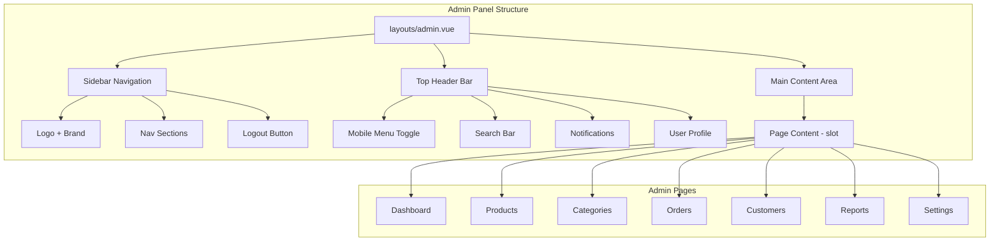

# Admin Panel Layout Guide

> **Purpose:** This guide documents the layout, structure, and design patterns of the KZProducts Admin Panel. Use this as a reference to recreate the same admin panel layout in future projects. The colors can vary, but the structural layout should be preserved.

---

## Visual Overview

### Full Dashboard Layout


### Sidebar Navigation


### Data Table (Products Page)


### Grid Layout (Categories Page)


### Settings Form Layout


---

## Architecture Overview



---

## File Structure

```
├── layouts/
│   └── admin.vue              # Main admin layout with sidebar + header
├── config/
│   └── admin.nav.ts           # Navigation configuration
├── middleware/
│   └── admin.ts               # Admin access middleware
├── pages/admin/
│   ├── index.vue              # Dashboard
│   ├── products/index.vue     # Products management
│   ├── categories/index.vue   # Categories management
│   ├── orders/index.vue       # Orders management
│   ├── customers/index.vue    # Customers list
│   ├── reports/index.vue      # Reports & analytics
│   └── settings/index.vue     # Store settings
├── components/admin/
│   ├── StatWidget.vue         # Dashboard stat cards
│   ├── RevenueChart.vue       # Revenue line chart
│   ├── ProductDrawer.vue      # Product create/edit drawer
│   ├── CategoryDrawer.vue     # Category create/edit drawer
│   ├── OrderModal.vue         # Order details modal
│   ├── CsvImportExportButtons.vue
│   ├── CsvImportModal.vue
│   └── ImageUploader.vue
└── server/utils/
    └── requireAdmin.ts        # Server-side admin validation
```

---

## Layout Components

### 1. Main Layout (`layouts/admin.vue`)

The admin layout consists of three main sections:

| Section          | Description           | Key Features                                      |
| ---------------- | --------------------- | ------------------------------------------------- |
| **Sidebar**      | Fixed left navigation | Collapsible, mobile responsive, grouped nav items |
| **Top Header**   | Sticky top bar        | Search, notifications, user profile               |
| **Main Content** | Page content area     | Responsive padding, scrollable                    |

#### Layout Template Structure

```vue
<template>
  <div class="min-h-screen text-white bg-slate-950">
    <!-- Mobile menu overlay -->
    <div
      v-if="mobileMenuOpen"
      class="fixed inset-0 z-40 backdrop-blur-sm bg-black/50 lg:hidden"
    />

    <!-- Sidebar -->
    <aside
      :class="[
        'fixed top-0 left-0 z-50 h-full border-r border-white/10 bg-slate-950/80 backdrop-blur-md transition-all duration-300',
        sidebarOpen ? 'w-64' : 'w-20',
      ]"
    >
      <!-- Logo -->
      <!-- Navigation sections -->
      <!-- User/Logout -->
    </aside>

    <!-- Main content wrapper -->
    <div
      :class="[
        'min-h-screen transition-all duration-300',
        sidebarOpen ? 'lg:ml-64' : 'lg:ml-20',
      ]"
    >
      <!-- Top bar -->
      <header
        class="sticky top-0 z-30 border-b backdrop-blur-md border-white/10 bg-slate-950/80"
      >
        <!-- Mobile menu button | Search | Notifications | User -->
      </header>

      <!-- Page content -->
      <main class="p-4 lg:p-6">
        <slot />
      </main>
    </div>
  </div>
</template>
```

---

### 2. Sidebar Navigation

#### Navigation Configuration (`config/admin.nav.ts`)

```typescript
import {
  LayoutDashboard,
  Package,
  ShoppingCart,
  Users,
  Settings,
  BarChart3,
  Tags,
} from "lucide-vue-next";

export interface AdminNavSection {
  title?: string;
  items: AdminNavItem[];
}

export const adminNavigation: AdminNavSection[] = [
  {
    items: [{ label: "Dashboard", icon: LayoutDashboard, href: "/admin" }],
  },
  {
    title: "Store",
    items: [
      { label: "Products", icon: Package, href: "/admin/products" },
      { label: "Categories", icon: Tags, href: "/admin/categories" },
      { label: "Orders", icon: ShoppingCart, href: "/admin/orders" },
    ],
  },
  {
    title: "Customers",
    items: [{ label: "All Customers", icon: Users, href: "/admin/customers" }],
  },
  {
    title: "Analytics",
    items: [{ label: "Reports", icon: BarChart3, href: "/admin/reports" }],
  },
  {
    title: "System",
    items: [{ label: "Settings", icon: Settings, href: "/admin/settings" }],
  },
];
```

#### Sidebar Features

- **Collapsible:** Toggle between expanded (w-64) and collapsed (w-20) states
- **Mobile Responsive:** Hidden on mobile, accessible via hamburger menu
- **Section Headers:** Uppercase, small text for grouping
- **Active State:** Highlighted with accent color background
- **Icons:** Lucide Vue icons for all navigation items

---

## Design System

### Color Palette

| Element          | Color            | CSS                                      |
| ---------------- | ---------------- | ---------------------------------------- |
| Background       | Dark Slate       | `bg-slate-950` (#0f172a)                 |
| Card Background  | Semi-transparent | `bg-white/5`                             |
| Card Border      | Subtle white     | `border-white/10`                        |
| Accent (Primary) | Violet           | `text-violet-400` / `bg-violet-500`      |
| Accent (Success) | Emerald          | `text-emerald-400` / `bg-emerald-500/20` |
| Accent (Warning) | Amber            | `text-amber-400` / `bg-amber-500/20`     |
| Accent (Danger)  | Rose             | `text-rose-400` / `bg-rose-500`          |
| Accent (Info)    | Blue             | `text-blue-400` / `bg-blue-500/20`       |
| Text Primary     | White            | `text-white`                             |
| Text Secondary   | Slate 400        | `text-slate-400`                         |
| Text Muted       | Slate 500        | `text-slate-500`                         |

### Border Radius

| Element          | Radius      | CSS                    |
| ---------------- | ----------- | ---------------------- |
| Cards            | Extra large | `rounded-2xl` (1rem)   |
| Buttons          | Large       | `rounded-xl` (0.75rem) |
| Inputs           | Large       | `rounded-xl`           |
| Badges           | Full        | `rounded-full`         |
| Icons containers | Large       | `rounded-xl`           |

### Glassmorphism Card Pattern

```css
/* Standard glassmorphic card */
.card {
  @apply rounded-2xl border border-white/10 bg-white/5 backdrop-blur-md;
}

/* Hover state for interactive cards */
.card:hover {
  @apply border-white/20 bg-white/[0.07];
}
```

---

## Page Layout Patterns

### Pattern 1: Dashboard with Stats Grid

```vue
<template>
  <div>
    <!-- Page header -->
    <div class="mb-8">
      <h1 class="text-2xl font-bold text-white">Dashboard</h1>
      <p class="mt-1 text-slate-400">Welcome to your admin dashboard</p>
    </div>

    <!-- Stats grid (4 columns on large screens) -->
    <div class="grid gap-4 sm:grid-cols-2 lg:grid-cols-4">
      <AdminStatWidget title="Total Revenue" :value="..." :icon="DollarSign" />
      <AdminStatWidget title="Total Orders" :value="..." :icon="ShoppingCart" />
      <!-- ... more widgets -->
    </div>

    <!-- Chart section -->
    <div class="mt-6">
      <AdminRevenueChart />
    </div>

    <!-- Recent data table -->
    <div class="mt-8">
      <h2 class="mb-4 text-lg font-semibold text-white">Recent Orders</h2>
      <!-- Table component -->
    </div>
  </div>
</template>
```

### Pattern 2: Data Table Page

```vue
<template>
  <div>
    <!-- Page header with action button -->
    <div
      class="flex flex-col gap-4 mb-6 sm:flex-row sm:items-center sm:justify-between"
    >
      <div>
        <h1 class="text-2xl font-bold text-white">Products</h1>
        <p class="mt-1 text-slate-400">Manage your product catalog</p>
      </div>
      <button
        class="flex gap-2 items-center px-4 py-2.5 font-medium text-white bg-violet-500 rounded-xl"
      >
        <Plus class="w-5 h-5" />
        Add Product
      </button>
    </div>

    <!-- Search & Filters -->
    <div
      class="p-4 mb-6 rounded-2xl border backdrop-blur-md border-white/10 bg-white/5"
    >
      <div class="relative flex-1">
        <Search
          class="absolute left-3 top-1/2 w-5 h-5 -translate-y-1/2 text-slate-500"
        />
        <input
          type="text"
          placeholder="Search..."
          class="py-2.5 pr-4 pl-10 w-full rounded-xl border border-white/10 bg-white/5"
        />
      </div>
    </div>

    <!-- Data table -->
    <div
      class="overflow-hidden rounded-2xl border backdrop-blur-md border-white/10 bg-white/5"
    >
      <table class="w-full">
        <thead class="border-b border-white/10 bg-white/5">
          ...
        </thead>
        <tbody class="divide-y divide-white/5">
          ...
        </tbody>
      </table>
      <!-- Pagination -->
    </div>
  </div>
</template>
```

### Pattern 3: Grid Cards Page (Categories)

```vue
<template>
  <div>
    <!-- Header with action button -->
    <div
      class="flex flex-col gap-4 mb-6 sm:flex-row sm:items-center sm:justify-between"
    >
      <div>
        <h1 class="text-2xl font-bold text-white">Categories</h1>
        <p class="text-slate-400">Manage product categories</p>
      </div>
      <button
        class="inline-flex gap-2 items-center px-4 py-2.5 font-medium text-white bg-violet-500 rounded-xl"
      >
        <Plus class="w-5 h-5" />
        Add Category
      </button>
    </div>

    <!-- Search bar -->
    <div class="mb-6">
      <div class="relative">
        <Search
          class="absolute left-4 top-1/2 w-5 h-5 -translate-y-1/2 text-slate-400"
        />
        <input
          type="text"
          placeholder="Search categories..."
          class="py-3 pr-4 pl-12 w-full rounded-xl border border-white/10 bg-white/5"
        />
      </div>
    </div>

    <!-- Grid layout (3 columns on large screens) -->
    <div class="grid gap-4 sm:grid-cols-2 lg:grid-cols-3">
      <div
        v-for="category in categories"
        class="p-4 rounded-2xl border transition-all border-white/10 bg-white/5 hover:border-violet-500/30 hover:bg-white/10"
      >
        <!-- Image placeholder -->
        <div class="overflow-hidden mb-4 rounded-xl aspect-video bg-slate-800">
          ...
        </div>
        <!-- Info -->
        <h3 class="text-lg font-semibold text-white">{{ category.name }}</h3>
        <p class="mb-4 text-sm text-slate-400">{{ category.slug }}</p>
        <!-- Actions -->
        <div class="flex gap-2">
          <button
            class="flex-1 px-3 py-2 text-sm rounded-lg border border-white/10 bg-white/5"
          >
            Edit
          </button>
          <button
            class="px-3 py-2 rounded-lg border border-white/10 bg-white/5"
          >
            Delete
          </button>
        </div>
      </div>
    </div>
  </div>
</template>
```

### Pattern 4: Settings Form Page

```vue
<template>
  <div>
    <!-- Header -->
    <div class="mb-6">
      <h1 class="text-2xl font-bold text-white">Settings</h1>
      <p class="text-slate-400">Configure your store preferences</p>
    </div>

    <div class="space-y-6">
      <!-- Section Card -->
      <div class="p-6 rounded-2xl border border-white/10 bg-white/5">
        <!-- Section header with icon -->
        <div class="flex gap-3 items-center mb-6">
          <div
            class="flex justify-center items-center w-10 h-10 rounded-xl bg-violet-500/20"
          >
            <Store class="w-5 h-5 text-violet-400" />
          </div>
          <div>
            <h2 class="text-lg font-semibold text-white">Store Information</h2>
            <p class="text-sm text-slate-400">Basic store details</p>
          </div>
        </div>

        <!-- Form fields grid -->
        <div class="grid gap-4 sm:grid-cols-2">
          <div>
            <label class="block mb-2 text-sm font-medium text-slate-300"
              >Store Name</label
            >
            <input
              type="text"
              class="px-4 py-3 w-full rounded-xl border border-white/10 bg-white/5"
            />
          </div>
          <!-- More fields... -->
        </div>
      </div>

      <!-- More sections... -->

      <!-- Save button -->
      <div class="flex justify-end">
        <button
          class="px-6 py-3 font-medium text-white bg-violet-500 rounded-xl hover:bg-violet-600"
        >
          Save Settings
        </button>
      </div>
    </div>
  </div>
</template>
```

---

## Reusable Components

### StatWidget Component

```vue
<template>
  <div
    class="rounded-2xl border border-white/10 bg-white/5 p-6 backdrop-blur-md transition-all hover:border-white/20 hover:bg-white/[0.07]"
  >
    <div class="flex justify-between items-center mb-4">
      <p class="text-sm font-medium text-slate-400">{{ title }}</p>
      <div
        :class="[
          'flex h-10 w-10 items-center justify-center rounded-xl',
          iconColor,
        ]"
      >
        <component :is="icon" class="w-5 h-5" />
      </div>
    </div>
    <p class="text-3xl font-bold text-white">{{ value }}</p>
    <div v-if="change !== undefined" class="flex gap-1.5 items-center mt-2">
      <span
        :class="[
          'flex items-center gap-0.5 text-sm font-medium',
          isPositive ? 'text-emerald-400' : 'text-rose-400',
        ]"
      >
        <TrendingUp v-if="isPositive" class="w-4 h-4" />
        <TrendingDown v-else class="w-4 h-4" />
        {{ Math.abs(change) }}%
      </span>
      <span class="text-sm text-slate-500">{{ changeLabel }}</span>
    </div>
  </div>
</template>
```

**Props:**
| Prop | Type | Description |
|------|------|-------------|
| `title` | string | Widget title |
| `value` | string/number | Display value |
| `change` | number | Percentage change |
| `changeLabel` | string | Change context text |
| `icon` | LucideIcon | Icon component |
| `iconColor` | string | CSS classes for icon container |
| `loading` | boolean | Show loading skeleton |

---

### Data Table Pattern

```vue
<div class="overflow-hidden rounded-2xl border backdrop-blur-md border-white/10 bg-white/5">
  <table class="w-full">
    <!-- Header -->
    <thead class="border-b border-white/10 bg-white/5">
      <tr>
        <th class="px-6 py-4 text-xs font-semibold tracking-wider text-left uppercase text-slate-400">
          Column Name
        </th>
        <!-- More columns... -->
      </tr>
    </thead>

    <!-- Body -->
    <tbody class="divide-y divide-white/5">
      <tr v-for="item in items" :key="item.id" class="transition-colors hover:bg-white/5">
        <td class="px-6 py-4">
          <!-- Cell content -->
        </td>
      </tr>
    </tbody>
  </table>

  <!-- Pagination -->
  <div v-if="totalPages > 1" class="flex justify-between items-center px-6 py-4 border-t border-white/10">
    <p class="text-sm text-slate-400">Showing {{ from }} to {{ to }} of {{ total }}</p>
    <div class="flex gap-2 items-center">
      <button :disabled="currentPage === 1" class="p-2 rounded-lg transition-colors text-slate-400 hover:bg-white/5 disabled:opacity-50">
        <ChevronLeft class="w-5 h-5" />
      </button>
      <span class="px-3 text-sm text-slate-300">Page {{ currentPage }} of {{ totalPages }}</span>
      <button :disabled="currentPage === totalPages" class="p-2 rounded-lg transition-colors text-slate-400 hover:bg-white/5 disabled:opacity-50">
        <ChevronRight class="w-5 h-5" />
      </button>
    </div>
  </div>
</div>
```

---

### Status Badges

```vue
<!-- Success status (Active, Paid, Delivered) -->
<span
  class="inline-flex px-2.5 py-1 text-xs font-medium text-emerald-400 rounded-full bg-emerald-500/20"
>
  Active
</span>

<!-- Warning status (Pending, Low Stock) -->
<span
  class="inline-flex px-2.5 py-1 text-xs font-medium text-amber-400 rounded-full bg-amber-500/20"
>
  Pending
</span>

<!-- Info status (Shipped) -->
<span
  class="inline-flex px-2.5 py-1 text-xs font-medium text-blue-400 rounded-full bg-blue-500/20"
>
  Shipped
</span>

<!-- Danger status (Cancelled) -->
<span
  class="inline-flex px-2.5 py-1 text-xs font-medium text-rose-400 rounded-full bg-rose-500/20"
>
  Cancelled
</span>

<!-- Neutral status (Draft) -->
<span
  class="inline-flex px-2.5 py-1 text-xs font-medium rounded-full bg-slate-500/20 text-slate-400"
>
  Draft
</span>
```

---

### Alert Card (e.g., Low Stock Alert)

```vue
<div class="p-4 rounded-2xl border border-amber-500/30 bg-amber-500/10">
  <div class="flex gap-3 items-center">
    <div class="flex justify-center items-center w-10 h-10 rounded-xl bg-amber-500/20">
      <AlertTriangle class="w-5 h-5 text-amber-400" />
    </div>
    <div>
      <p class="font-medium text-amber-400">Low Stock Alert</p>
      <p class="text-sm text-slate-400">{{ count }} product(s) have less than 5 items in stock</p>
    </div>
    <NuxtLink to="/admin/products" class="px-4 py-2 ml-auto text-sm font-medium text-amber-400 rounded-lg transition-colors bg-amber-500/20 hover:bg-amber-500/30">
      View Products
    </NuxtLink>
  </div>
</div>
```

---

## Form Elements

### Text Input

```vue
<div>
  <label class="block mb-2 text-sm font-medium text-slate-300">Field Label</label>
  <input
    type="text"
    v-model="value"
    placeholder="Placeholder text..."
    class="px-4 py-3 w-full text-white rounded-xl border transition-colors outline-none border-white/10 bg-white/5 placeholder-slate-500 focus:border-violet-500/50 focus:ring-2 focus:ring-violet-500/20"
  />
</div>
```

### Search Input with Icon

```vue
<div class="relative">
  <Search class="absolute left-3 top-1/2 w-5 h-5 -translate-y-1/2 text-slate-500" />
  <input
    type="text"
    placeholder="Search..."
    class="py-2.5 pr-4 pl-10 w-full text-white rounded-xl border transition-colors outline-none border-white/10 bg-white/5 placeholder-slate-500 focus:border-violet-500/50 focus:ring-2 focus:ring-violet-500/20"
  />
</div>
```

### Select Dropdown

```vue
<div>
  <label class="block mb-2 text-sm font-medium text-slate-300">Select Label</label>
  <select class="px-4 py-3 w-full text-white rounded-xl border outline-none border-white/10 bg-white/5 focus:border-violet-500/50">
    <option value="option1">Option 1</option>
    <option value="option2">Option 2</option>
  </select>
</div>
```

### Toggle Switch

```vue
<label class="flex justify-between items-center cursor-pointer">
  <div>
    <p class="font-medium text-white">Toggle Label</p>
    <p class="text-sm text-slate-400">Description of the toggle</p>
  </div>
  <div class="relative">
    <input type="checkbox" v-model="enabled" class="sr-only peer" />
    <div class="w-11 h-6 rounded-full transition-colors bg-slate-700 peer peer-checked:bg-violet-500" />
    <div class="absolute top-0.5 left-0.5 w-5 h-5 bg-white rounded-full transition-transform peer-checked:translate-x-5" />
  </div>
</label>
```

---

## Button Patterns

### Primary Button (Violet)

```vue
<button
  class="flex gap-2 items-center px-4 py-2.5 font-medium text-white bg-violet-500 rounded-xl shadow-lg transition-all shadow-violet-500/25 hover:bg-violet-600 hover:shadow-violet-500/40"
>
  <Plus class="w-5 h-5" />
  Add Item
</button>
```

### Secondary Button (Ghost)

```vue
<button
  class="px-6 py-2.5 font-medium text-white rounded-xl transition-colors bg-white/5 hover:bg-white/10"
>
  Cancel
</button>
```

### Outline Button

```vue
<button
  class="flex-1 px-4 py-2.5 font-medium text-white bg-transparent rounded-xl border transition-colors border-white/10 hover:bg-white/5"
>
  Cancel
</button>
```

### Danger Button

```vue
<button
  class="flex-1 px-4 py-2.5 font-medium text-white bg-rose-500 rounded-xl transition-colors hover:bg-rose-600"
>
  Delete
</button>
```

### Icon Button

```vue
<button
  class="p-2 rounded-lg transition-colors text-slate-400 hover:bg-white/5 hover:text-white"
  title="Edit"
>
  <Pencil class="w-4 h-4" />
</button>
```

---

## Responsive Breakpoints

| Breakpoint | Width  | Usage                             |
| ---------- | ------ | --------------------------------- |
| `sm`       | 640px  | 2-column grids, flex row layouts  |
| `md`       | 768px  | Show/hide table columns           |
| `lg`       | 1024px | Sidebar visible, 3-4 column grids |

### Responsive Patterns

```vue
<!-- Stats grid: 1 col → 2 cols → 4 cols -->
<div class="grid gap-4 sm:grid-cols-2 lg:grid-cols-4">

<!-- Category cards: 1 col → 2 cols → 3 cols -->
<div class="grid gap-4 sm:grid-cols-2 lg:grid-cols-3">

<!-- Table column visibility -->
<th class="hidden md:table-cell">Category</th>
<th class="hidden sm:table-cell">Stock</th>
<th class="hidden lg:table-cell">Status</th>

<!-- Sidebar margin -->
<div :class="[sidebarOpen ? 'lg:ml-64' : 'lg:ml-20']">
```

---

## Dependencies

### Required Packages

- **lucide-vue-next** - Icon library
- **vue-chartjs** + **chart.js** - Charts for revenue graphs
- **vue-sonner** - Toast notifications

### Icon Usage

All icons are imported from `lucide-vue-next`:

```typescript
import {
  LayoutDashboard,
  Package,
  ShoppingCart,
  Users,
  Settings,
  BarChart3,
  Tags,
  Menu,
  X,
  Search,
  Bell,
  LogOut,
  ChevronDown,
  Plus,
  Pencil,
  Trash2,
  ChevronLeft,
  ChevronRight,
  TrendingUp,
  TrendingDown,
  DollarSign,
  AlertTriangle,
  ArrowRight,
  Eye,
  Mail,
  Calendar,
  FolderOpen,
  Store,
  Palette,
  Globe,
  Shield,
} from "lucide-vue-next";
```

---

## Quick Reference Checklist

When building a new admin panel with this layout:

- [ ] Create `layouts/admin.vue` with sidebar + header + main content
- [ ] Create `config/admin.nav.ts` with navigation configuration
- [ ] Create `middleware/admin.ts` for access control
- [ ] Use `rounded-2xl border border-white/10 bg-white/5` for all cards
- [ ] Use `rounded-xl` for buttons and inputs
- [ ] Use color-coded stat widgets on dashboard
- [ ] Use consistent page header pattern (h1 + description + action button)
- [ ] Use search bar with icon prefix pattern
- [ ] Use data table with pagination for lists
- [ ] Use grid layout (2-3 columns) for card-based content
- [ ] Use form sections with icon headers for settings pages
- [ ] Add toast notifications with `vue-sonner`
- [ ] Use Lucide icons throughout

---

> **Note:** This guide focuses on **layout and structure**. Colors can be customized by changing the accent color from violet to any other color in the Tailwind palette while maintaining the same structural patterns.
